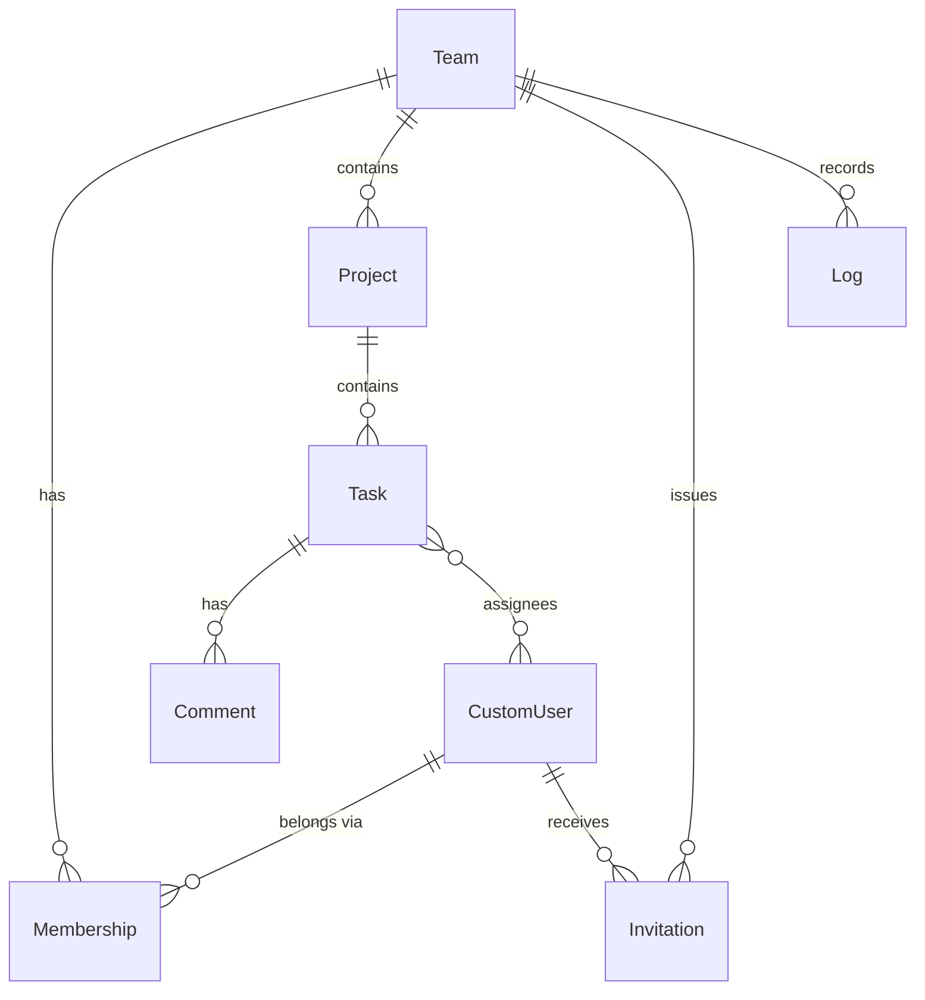

<div align="center">

# TMS

**Team-based Task Management API**

A multi-tenant REST API for teams, projects, tasks, and activity tracking — built on Django.

<br/>

[](https://www.python.org/)
[](https://www.djangoproject.com/)
[](https://www.django-rest-framework.org/)
[](https://www.postgresql.org/)
[](https://redis.io/)
[](https://docs.docker.com/compose/)
[](LICENSE)

<br/>

[Features](#features) ·
[Architecture](#architecture) ·
[Roles & Permissions](#roles--permissions) ·
[API](#api-surface) ·
[Quickstart](#quickstart) ·
[Frontend](#frontend) ·
[Deployment](#deployment) ·
[Roadmap](#roadmap)

</div>

---

## Features

| | |
|---|---|
| **Multi-tenant teams** | Every resource lives under a team; querysets are scoped through the URL hierarchy, so cross-tenant access resolves to a 404 at the ORM level |
| **JWT authentication** | Short-lived access tokens (15 min) with rotating refresh tokens, blacklist-on-rotation, and full token revocation on password change |
| **Role-based access control** | Four roles (`owner` → `maintainer` → `member` → `viewer`) mapped to fine-grained scopes such as `task:assign` and `team:invite` |
| **Invitation workflow** | Email-addressed invites with an explicit state machine (`pending → accepted / rejected / cancelled`), a per-user inbox, and 3-day expiry; membership is created atomically on accept |
| **Projects, tasks & comments** | Nested resources with status, priority, due dates, multi-assignee support, filtering, search, and ordering |
| **Activity logs** | An append-only, per-team audit feed recorded transactionally alongside every mutation |
| **Background jobs** | Celery workers deliver invitation, task-assignment, and status-change emails asynchronously — dispatched only after the transaction commits, with exponential-backoff retries |
| **Database-enforced invariants** | Unique and check constraints back every application-level rule |
| **OpenAPI documentation** | Interactive Swagger and ReDoc docs generated by drf-spectacular |
| **Rate limiting** | 60 req/min anonymous, 120 req/min authenticated, backed by Redis |
| **Production deployment** | Multi-stage `uv` Docker build, non-root runtime, gunicorn behind nginx with TLS |

---

## Architecture

```
Client ──▶ nginx (TLS, SPA + static) ──▶ gunicorn / Django ──▶ PostgreSQL 17 (pooled)
                                        │
                                        └──▶ Redis 7 (cache, throttling, Celery broker)
                                                  │
                                                  └──▶ Celery worker & beat ──▶ email (Resend)
```

### Domain model



Every model inherits a shared `BaseModel` providing **UUIDv7 primary keys** — time-ordered and non-enumerable — plus `created_at` / `updated_at` timestamps.

### Project layout

```
TMS/
├── base/        # Shared BaseModel (UUIDv7 + timestamps), health endpoint
├── users/       # Custom user model, registration, JWT auth, password change
├── teams/       # Teams, memberships, roles, invitations, RBAC scopes
├── projects/    # Team-scoped projects
├── tasks/       # Project-scoped tasks & comments
├── logs/        # Per-team append-only activity feed
├── cfg/         # Settings, root URLconf, WSGI/ASGI
├── frontend/    # React SPA (Vite + Bun); dist/ is served by nginx
├── docker/      # Dockerfile + dev/prod compose stacks
└── nginx/       # Reverse-proxy configs (dev & TLS-terminated prod)
```

---

## Roles & Permissions

Roles are ordered supersets — each role inherits everything below it.

| Scope | Viewer | Member | Maintainer | Owner |
|-------|:------:|:------:|:----------:|:-----:|
| `team:view` · `task:view` · `task:comment` | ● | ● | ● | ● |
| `task:create` | | ● | ● | ● |
| `team:invite` | | | ● | ● |
| `project:create` · `project:edit` · `project:delete` | | | ● | ● |
| `task:assign` · `task:update` · `task:delete` | | | ● | ● |
| `team:update` · `team:delete` · `team:change_roles` · `team:remove` | | | | ● |

> A team always retains at least one owner — the API refuses the last owner's departure or demotion.

Object-level rules refine the matrix where it makes sense: task **assignees** may update their own tasks, comment **authors** manage their own comments, and invite **receivers** accept or reject their own invitations.

---

## API Surface

All endpoints are versioned under `/api/v1/` and paginated (20 per page).

<details open>
<summary><b>Authentication</b></summary>
<br/>

| Method | Endpoint | Description |
|--------|----------|-------------|
| `POST` | `/auth/register/` | Create an account |
| `POST` | `/auth/login/` | Obtain access + refresh token pair |
| `POST` | `/auth/refresh/` | Rotate the refresh token |
| `POST` | `/auth/logout/` | Blacklist the refresh token |
| `GET` `PATCH` | `/auth/me/` | Retrieve / update the current user |
| `GET` | `/auth/invites/` | Invitations addressed to the current user |
| `PUT` `PATCH` | `/auth/password/` | Change password (revokes outstanding refresh tokens) |

</details>

<details open>
<summary><b>Teams</b></summary>
<br/>

| Method | Endpoint | Description |
|--------|----------|-------------|
| `GET` `POST` | `/teams/` | List / create teams |
| `GET` `PUT` `PATCH` `DELETE` | `/teams/{team}/` | Manage a team |
| `GET` | `/teams/{team}/members/` | List memberships |
| `GET` `PATCH` `DELETE` | `/teams/{team}/members/{membership}/` | Change role · remove · leave |
| `GET` `POST` | `/teams/{team}/invites/` | List / send invitations (receiver addressed by email) |
| `GET` `PATCH` | `/teams/{team}/invites/{invite}/` | Accept · reject · cancel |
| `GET` | `/teams/{team}/logs/` | Team activity feed |

</details>

<details open>
<summary><b>Projects, Tasks & Comments</b></summary>
<br/>

| Method | Endpoint | Description |
|--------|----------|-------------|
| `GET` `POST` | `/teams/{team}/projects/` | List / create projects (searchable) |
| `GET` `PUT` `PATCH` `DELETE` | `/teams/{team}/projects/{project}/` | Manage a project |
| `GET` `POST` | `.../projects/{project}/tasks/` | List / create tasks — filter by `status` & `priority`, search by title, order by `created_at` / `due` |
| `GET` `PUT` `PATCH` `DELETE` | `.../tasks/{task}/` | Manage a task |
| `GET` `POST` | `.../tasks/{task}/comments/` | List / add comments |
| `GET` `PATCH` `DELETE` | `.../comments/{comment}/` | Manage a comment |

</details>

### Interactive documentation

| | |
|---|---|
| Swagger UI | `/api/v1/docs/` |
| ReDoc | `/api/v1/redoc/` |
| OpenAPI schema | `/api/v1/schema/` |
| Health check | `/health/` — reports database & cache connectivity with latency |

---

## Quickstart

> **Prerequisites:** Docker & Docker Compose, plus [Bun](https://bun.sh/) `1.3+` to build the frontend.

```bash
# 1. Clone
git clone <repo-url> && cd TMS

# 2. Configure
cp .env.example .env.dev        # edit values as needed

# 3. Build the frontend — nginx serves frontend/dist directly
cd frontend && bun install && bun run build && cd ..

# 4. Run — Postgres, Redis, Django (auto-migrate) & nginx
docker compose -f docker/compose.dev.yaml up --build
```

The full app is now live at **http://localhost:8000/** — nginx serves the React SPA from `frontend/dist` and proxies `/api`, `/admin`, and `/health` to Django. Backend source is bind-mounted, so the dev server hot-reloads; frontend changes need a re-run of `bun run build`.

> **Note:** build the frontend *before* `compose up`. The nginx service bind-mounts `frontend/dist`; if it doesn't exist yet, Docker creates it as an empty root-owned directory and the SPA serves 403s.

<details>
<summary><b>Running natively (without Docker)</b></summary>
<br/>

Requires Python 3.13+, [uv](https://docs.astral.sh/uv/), and reachable PostgreSQL + Redis instances.

```bash
uv sync                          # install dependencies
cp .env.example .env             # point POSTGRES_* / REDIS_URL at your services
set -a && source .env && set +a  # settings read plain environment variables — no dotenv loader
uv run manage.py migrate
uv run manage.py runserver
```

</details>

<details>
<summary><b>Try it</b></summary>
<br/>

```bash
# Register
curl -X POST http://localhost:8000/api/v1/auth/register/ \
  -H 'Content-Type: application/json' \
  -d '{"username": "ada", "email": "ada@example.com", "password": "correct-horse-battery"}'

# Login → grab the access token
curl -X POST http://localhost:8000/api/v1/auth/login/ \
  -H 'Content-Type: application/json' \
  -d '{"username": "ada", "password": "correct-horse-battery"}'

# Create a team (creator becomes owner automatically)
curl -X POST http://localhost:8000/api/v1/teams/ \
  -H "Authorization: Bearer $ACCESS" \
  -H 'Content-Type: application/json' \
  -d '{"name": "Analytical Engines"}'
```

</details>

---

## Frontend

A single-page React app (React 19 + Vite + `react-router-dom`) lives in [`frontend/`](frontend/). It's a Linear-inspired, Discord-flavored dark UI covering the full API surface — teams, projects, tasks, comments, members, invitations, and the activity feed.

There are two ways to run it locally:

**1. Served by nginx (the [Quickstart](#quickstart) default).** Build once, and the compose stack serves the SPA and the API from the same origin:

```bash
cd frontend && bun install && bun run build && cd ..
docker compose -f docker/compose.dev.yaml up
```

**2. Vite dev server (hot-reload, for active frontend work).** Run the API on port `8000` first (see [Quickstart](#quickstart)), then:

```bash
cd frontend
bun install                      # install dependencies
bun run dev                      # Vite dev server → http://localhost:5173
```

Vite proxies `/api` → `http://localhost:8000`, so no CORS configuration is required in development. Point at a different API by setting `VITE_API_URL` (defaults to `/api/v1`).

| Command | Description |
|---------|-------------|
| `bun run dev` | Start the Vite dev server with hot-reload on port `5173` |
| `bun run build` | Produce an optimized production build in `frontend/dist/` |
| `bun run preview` | Serve the production build locally |

**Stack:** React 19, Vite, `react-router-dom` v7, `lucide-react` icons, and `@fontsource/inter` — no CSS framework; styling is hand-authored design tokens in `src/styles/`. JWT access/refresh tokens are held in `localStorage` with transparent refresh-on-401.

---

## Deployment

The production stack (`docker/compose.prod.yaml`) runs **gunicorn** (3 workers) behind **nginx** with TLS via Let's Encrypt certificates mounted from the host, alongside dedicated **Celery worker** and **beat** containers for background jobs.

```bash
cp .env.example .env.prod        # set DEBUG=False, real secrets, hosts & origins
export DOMAIN=your.domain.example
cd frontend && bun install --frozen-lockfile && bun run build && cd ..
docker compose -f docker/compose.prod.yaml up --build -d
```

The stack provides:

- HTTP → HTTPS redirect, TLS 1.2/1.3 only, HTTP/2
- The React SPA served by nginx from `frontend/dist` (built on the host, bind-mounted read-only), with hashed assets cached immutably and `index.html` always revalidated
- Multi-stage image with `uv`-locked dependencies, running as a non-root user
- Migrations and `collectstatic` on boot; static files served by nginx with one-year immutable caching and gzip
- Health-gated startup for Postgres and Redis; `/health/` endpoint for external monitors
- Secure cookies and proxy-aware SSL redirect whenever `DEBUG=False`

---

## Roadmap

- Extend row-level locking to the role-change path (member removal already locks the team row)
- Fuzzy task search with Postgres `pg_trgm`
- Response caching for hot read endpoints
- Real-time task updates over WebSockets (Django Channels)
- Google OAuth sign-in
- Automated API test suite covering the RBAC permission matrix

---

## Design Rationale

Curious why UUIDv7 keys, code-defined RBAC, or snapshot-style activity logs?
See **[ENGINEERING_DECISIONS.md](ENGINEERING_DECISIONS.md)** — every non-obvious choice is documented as a mini-ADR.

---

<div align="center">

Released under the [MIT License](LICENSE) · © 2026 Sreyash Satpathy

</div>
